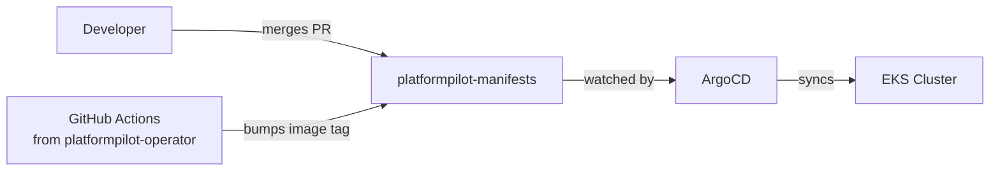

# platformpilot-manifests

GitOps source of truth for the PlatformPilot EKS cluster. ArgoCD watches this repository and reconciles the cluster to match.

> Part of [PlatformPilot](https://github.com/yuvalRipkin/platformpilot).

---

## Overview

This repository defines the desired state of the EKS cluster in Git. No CD pipeline pushes manifests to the cluster directly. Instead, ArgoCD polls this repository on a short interval, computes the diff against the live cluster state, and applies changes automatically. The cluster state at any point is fully auditable from git history.

Currently the repo manages the PlatformPilot operator: its Namespace, the `DevEnvironment` CRD, RBAC (Roles, ClusterRoles, bindings), metrics Service, and the controller Deployment. As PlatformPilot grows, additional workloads (platform addons, the RAG assistant) will be added here as separate ArgoCD Applications.

---

## How it works



The ArgoCD Application CRD in `argocd/application.yaml` is applied once manually to bootstrap the sync loop. After that, ArgoCD owns the reconciliation. Every commit to `main` that touches `deploy/` is picked up within the ArgoCD polling interval and applied to the cluster automatically.

---

## Repository layout

```
.
├── argocd/
│   └── application.yaml    # ArgoCD Application CRD — apply once to register the sync
└── deploy/
    └── install.yaml        # Flat raw YAML bundle: Namespace, CRD, RBAC, Deployment
```

There are no Kustomize overlays or Helm charts at this stage. `deploy/install.yaml` is a multi-document YAML file rendered from the operator's Kustomize build and committed directly. Environment separation (dev vs staging) is planned but not yet implemented.

---

## Applications managed

| Application | Source path | Sync policy | Destination namespace |
| --- | --- | --- | --- |
| `platformpilot-sync` | `deploy/` | Automated, prune, self-heal | `platformpilot-operator-system` |

One ArgoCD Application is registered. It manages everything in `deploy/`: the `DevEnvironment` CRD, the operator Deployment, and all associated RBAC.

---

## App-of-apps

This repo does not use the app-of-apps pattern yet. There is a single ArgoCD Application (`platformpilot-sync`) applied manually at bootstrap. As additional workloads are added (platform addons, a RAG assistant), the plan is to introduce a root Application that watches an `applications/` directory, with each file there pointing to a child workload. At that point the `argocd/` directory would become the root Application, and `deploy/` would become one of several child source paths.

---

## Environments

There is currently no environment separation in this repository. All changes merge to `main` and sync directly to the single EKS cluster. Planned approach:

- `overlays/dev/` and `overlays/staging/` Kustomize overlays layered over a `base/`
- Separate ArgoCD Applications per overlay, each targeting a different namespace or cluster
- Image tag pinned per environment so staging can lag behind dev during validation

---

## Image tag updates

The operator's CI pipeline (in [platformpilot-operator](https://github.com/yuvalRipkin/platformpilot)) handles image promotion:

1. A push to `main` triggers GitHub Actions.
2. The workflow builds the operator image and pushes it to ECR:
   ```
   568311962070.dkr.ecr.us-east-1.amazonaws.com/platformpilot-operator:<tag>
   ```
3. The workflow runs `yq` or a `sed` substitution to update the image field in `deploy/install.yaml`.
4. It commits the change directly to `main` of this repository as `github-actions`.
5. ArgoCD detects the new commit and syncs the updated Deployment to the cluster.

Example commit produced by CI:
```
chore: update operator image to v-aa477d9
```

> **Known issue:** commit `1ec0e73` (RBAC expansion) overwrote `deploy/install.yaml` from a regenerated Kustomize scaffold, reverting the image field back to `controller:latest`. The file currently reflects that reversion. This is a hygiene gap — see [Roadmap](#roadmap--gaps).

---

## Sync policies

The `platformpilot-sync` Application is configured with:

| Setting | Value | Effect |
| --- | --- | --- |
| `automated` | enabled | ArgoCD syncs on every detected diff without manual approval |
| `prune` | `true` | Resources deleted from Git are deleted from the cluster |
| `selfHeal` | `true` | Manual changes to cluster resources are reverted on the next reconciliation |
| `CreateNamespace` | `true` | ArgoCD creates the destination namespace if it does not exist |

No sync waves (`argocd.argoproj.io/sync-wave`) are configured. The CRD, RBAC, and Deployment are applied in a single wave. This can cause a race if the Deployment reconciles before the CRD is established — sync waves are on the roadmap.

---

## Local testing

Validate changes before committing by doing a dry-run against the API server:

```bash
# Dry-run against a local or remote cluster
kubectl apply --dry-run=client -f deploy/install.yaml

# Or server-side dry-run (validates against admission webhooks too)
kubectl apply --dry-run=server -f deploy/install.yaml
```

If you are regenerating `deploy/install.yaml` from the operator repo's Kustomize config:

```bash
# From platformpilot-operator root
kustomize build config/default > ../platformpilot-manifests/deploy/install.yaml
```

After regenerating, verify the image field was not reset to `controller:latest` before committing.

---

## Bootstrap

ArgoCD must be installed in the cluster before this Application CRD can be applied. Install ArgoCD first:

```bash
kubectl create namespace argocd
kubectl apply -n argocd -f https://raw.githubusercontent.com/argoproj/argo-cd/stable/manifests/install.yaml
```

Then register the PlatformPilot sync Application:

```bash
kubectl apply -f argocd/application.yaml
```

From this point ArgoCD polls `deploy/` on `main` and reconciles the cluster automatically. All subsequent changes go through Git — no direct `kubectl apply` to production.

---

## Roadmap / gaps

| Gap | Risk | Plan |
| --- | --- | --- |
| **Image field reverted to `controller:latest`** | Operator running a stale or invalid image | Re-run the image-bump CI step or manually patch `deploy/install.yaml` with the correct ECR URI |
| **No sync waves** | CRD / RBAC / Deployment applied in one wave; potential ordering failures | Add `argocd.argoproj.io/sync-wave` annotations: CRD on wave 0, RBAC on wave 1, Deployment on wave 2 |
| **No environment overlays** | Single environment; a bad commit affects production immediately | Add Kustomize `base/` + `overlays/dev/` and `overlays/staging/` with separate Applications |
| **No secret management** | Secrets must be applied manually out-of-band | Integrate [External Secrets Operator](https://external-secrets.io/) backed by AWS Secrets Manager |
| **No app-of-apps** | Each new workload requires manual ArgoCD registration | Introduce a root Application watching `applications/`; child Applications for operator, addons, RAG bot |
| **No ArgoCD notifications** | Sync failures and health degradations are silent | Configure `argocd-notifications` with a Slack or PagerDuty sink |
| **No policy enforcement** | Nothing prevents direct `kubectl apply` bypassing GitOps | Add an OPA/Kyverno policy denying writes from non-ArgoCD service accounts in production namespaces |
| **No AppProject** | Uses ArgoCD `default` project; no source or destination restrictions | Define a dedicated `AppProject` scoping this Application to its ECR source and EKS destination |
